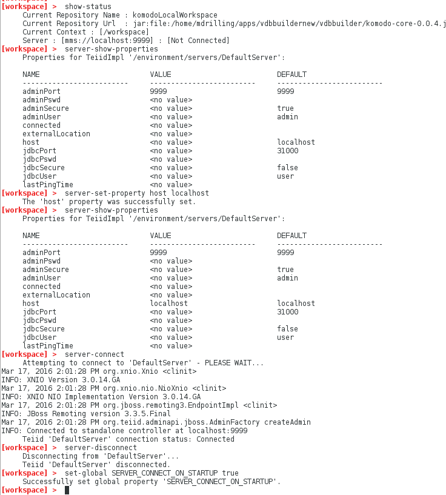

### Connect to a Server

This document shows how to connect to a teiid server instance within the VDB Builder cli.  It also demonstrates how to view the vdbs deployed to the server after you have successfully connected.

Note that in __VDB Builder__, you can use __tab completion__ to see the available commands options, or use __help commandName__ to see command details.

### Requirements

* Install VDB Builder cli - refer to the [Installation Instructions](install-cli.md) for details

### Connect to a server

The VDB Builder cli can connect to a running teiid server.  The global property __SERVER_CONNECT_ON_STARTUP__ controls whether VDBBuilder will try to connect to the server on startup.  By default, it is set to __true__, with a set of default properties.  The sample session below shows how to determine if the server is connected and how to change the server connection properties.  Once you are connected to the server, several more server commands will become available.  You can discover the available server commands in VDBBuilder by typing 'help' after connecting to the server.

---
Here is a summary of the commands used for the above session:

* __`show-status`__ - shows the VDBBuilder status - notice that the server is [Not Connected].
* __`server-show-properties`__ - shows the current server connection properties.
* __`server-set-property host localhost`__ - command to set the server host to __localhost__.
* __`server-show-properties`__ - shows the current server connection properties.
* __`server-connect`__ - connects to the default server. 
* __`server-disconnect`__ - disconnects from the default server.
* __`set-global SERVER_CONNECT_ON_STARTUP true`__ - specify that VDBBuilder should connect to the defined server on startup.

---
