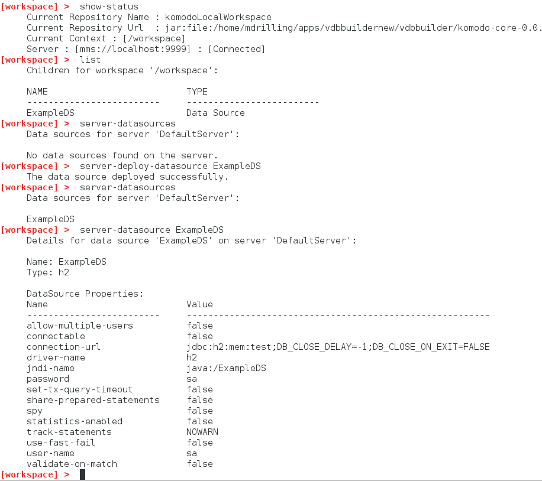
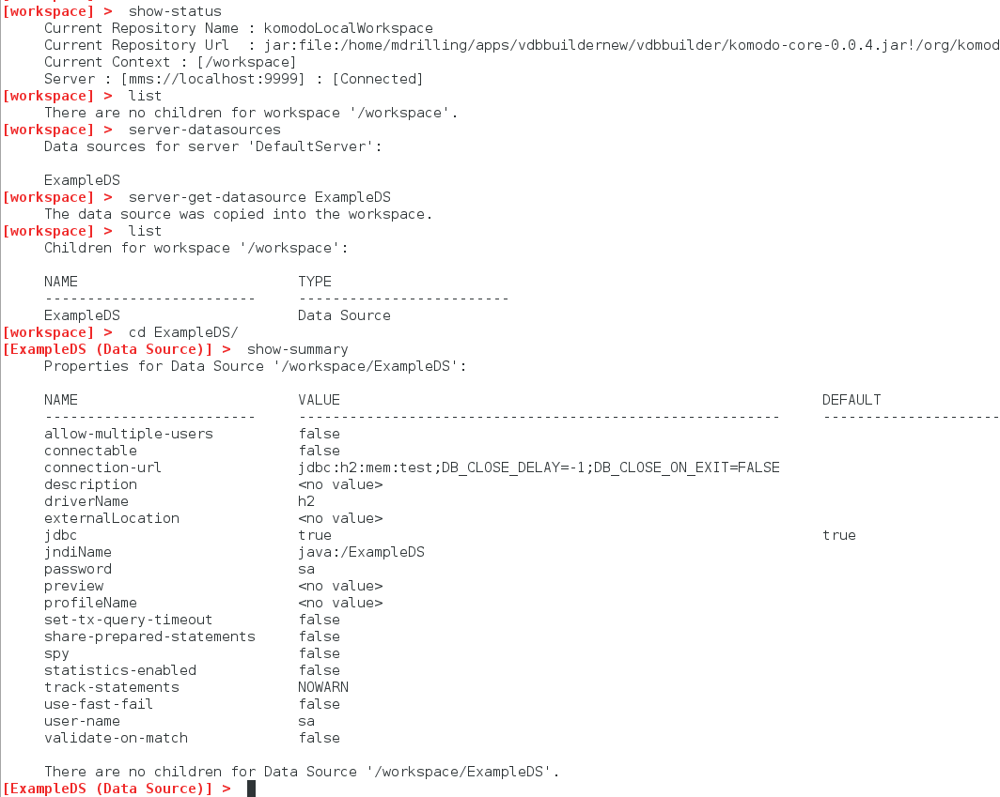
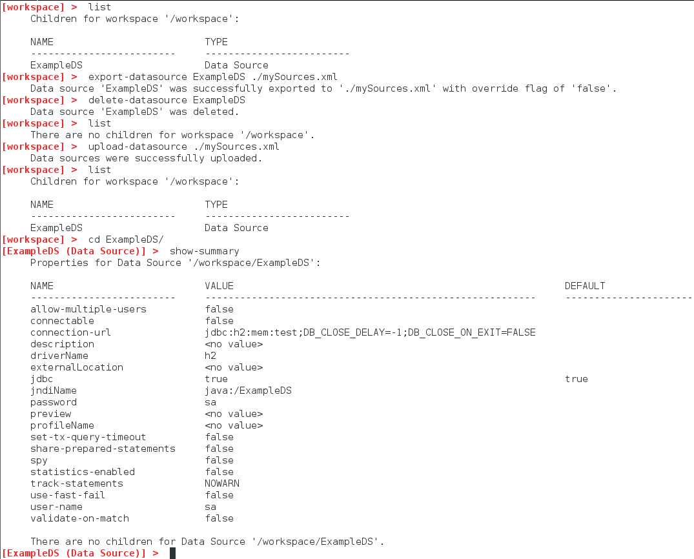

### Interact with server data sources

This document shows a few different ways you can interact with server data sources:
* Deploy a data source from your VDB Builder workspace to the connected server.
* Get a data source from the connected server and store it in your VDB Builder workspace.
* Import/Export data sources from the VDB Builder workspace to your file system.

This opens up a lot of possibilites for working with data sources.  For example you can define a data source in VDB Builder, then deploy it to a running server.  Or, you could fetch a data source from the connected server, then edit it and re-deploy it with a new name.

Note that in __VDB Builder__, you can use __tab completion__ to see the available commands options, or use __help commandName__ to see command details.

### Requirements

* Install VDB Builder cli - refer to the [Installation Instructions](install-cli.md) for details

### Deploy a data source from VDB Builder to a server

You can deploy a data source from VDB Builder to a running server.  The sample session below shows how to view the server and workspace data sources, and deploy a workspace data source to the running Server.

---
Here is a summary of the commands used for the above session:

* __`show-status`__ - display the shell status.  Note the current server status is [Connected]
* __`list`__ - show all children in __workspace__.  Note that we have a data source __ExampleDS__ in our workspace.
* __`server-datasources`__ - show all data sources on the connected server.  Note that __ExampleDS__ does not exist on the server.
* __`server-deploy-datasource ExampleDS`__ - deploy __ExampleDS__ from the workspace to the connected server.
* __`server-datasources`__ - again, show all data sources on the connect server.  Note that __ExampleDS__ has been deployed!
* __`server-datasource ExampleDS`__ - show more detail for __ExampleDS__ on the connect server.

---

### Get a data source from the server and store it in VDB Builder

You can also fetch a data source from a running server and save it to the VDB Builder workspace.  The sample session below shows how to view the server data sources and save a data source into your VDB Builder workspace.

---
Here is a summary of the commands used for the above session:

* __`show-status`__ - display the shell status.  Note the current server status is [Connected]
* __`list`__ - show all children in __workspace__.  Note that we do not have any data sources.
* __`server-datasources`__ - show all data sources on the connected server.  Note that __ExampleDS__ exists on the server. 
* __`server-get-datasource ExampleDS`__ - gets __ExampleDS__ from the connected server, and copies it to VDB Builder workspace.
* __`list`__ - show all children in __workspace__.  Note that __ExampleDS__ is now in the VDB Builder workspace!
* __`cd ExampleDS`__ - navigate into __ExampleDS__.
* __`show-summary`__ - shows a summary (properties and children) for the current context, __ExampleDS__

---

### Import/Export data sources from the workspace to your file system.

You can import data source definitions from your file system, or export a data source from your workspace to your file system.  The sample session below illustrates both.

---
Here is a summary of the commands used for the above session:

* __`list`__ - show all children in __workspace__.  Note that we have one data source __ExampleDS__.
* __`export-datasource ExampleDS ./mySources.xml`__ - export __ExampleDS__ to file __mySources.xml__ in the VDB builder installation directory. 
* __`delete-datasource ExampleDS`__ - removes the data source __ExampleDS__ from the workspace.
* __'upload-datasource ./mySources.xml'__ - imports the data source definitions from __mySources.xml__ into the workspace. 
* __`list`__ - show all children in __workspace__.  Note that __ExampleDS__ is back in the VDB Builder workspace!
* __`cd ExampleDS`__ - navigate into __ExampleDS__.
* __`show-summary`__ - shows a summary (properties and children) for the current context, __ExampleDS__

---
