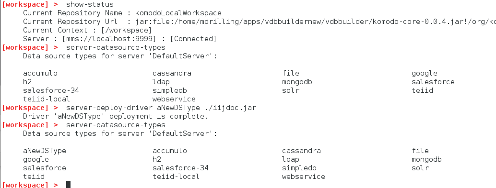

### Deploy a new datasource driver to a server

This document shows how to interact with server data source types (or drivers):
* View the available data source types on the connected server.
* Deploy a JDBC type4 driver from your file system to the connected server.

Note that in __VDB Builder__, you can use __tab completion__ to see the available commands options, or use __help commandName__ to see command details.

### Requirements

* Install VDB Builder cli - refer to the [Installation Instructions](install-cli.md) for details

### Deploy a new JDBC driver from your file system to a server

You can deploy a JDBC driver from your file system to a running server.  The driver must be a JDBC type4 driver, or it will not be recognized by the server.  The sample session below shows how to view the server data source types, and deploy a new JDBC driver from your file system to the server.

---
Here is a summary of the commands used for the above session:

* __`show-status`__ - display the shell status.  Note the default server is [Connected]
* __`server-datasource-types`__ - show all data source types on the connected server.
* __`server-deploy-driver aNewDSType ./iijdbc.jar`__ - deploys __iijdbc.jar__ located in the VDB Builder installation directory to the connected server.  It deploys with name __aNewDSType__.
* __`server-datasource-types`__ - again, show all data source types on the connect server.  Note that __aNewDSType__ is now available on the server!

---

